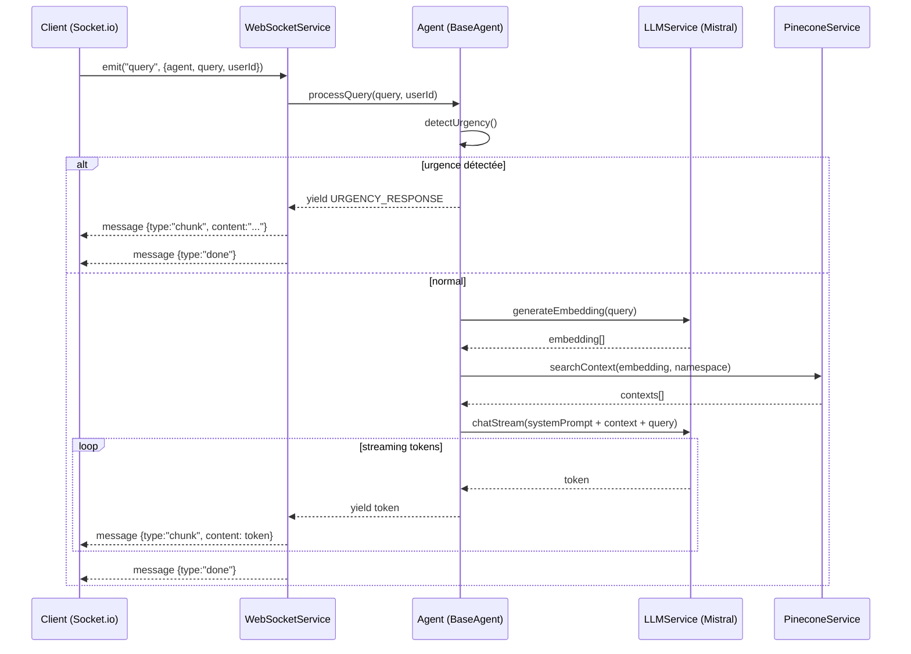

# Corevia IA Service (rag-communication-service)

Microservice IA pour Corevia : on lui envoie une question en temps réel (Socket.io), il récupère du contexte dans Pinecone (RAG), puis génère une réponse avec Mistral en **streaming** (token par token).

---

## 1) Explication “comme si tu avais 8 ans”

Imagine :

- Tu as un **robot** qui parle (le modèle Mistral).
- Mais le robot oublie plein de choses, donc on lui donne une **bibliothèque** (Pinecone).
- Quand tu poses une question, il va d’abord chercher dans la bibliothèque **les pages qui ressemblent le plus** à ta question.
- Ensuite il répond, en lisant “un petit bout à la fois”, et il t’envoie la réponse **morceau par morceau**.

Ce service, c’est juste “le monsieur à l’accueil” qui :
1) écoute ta question via Internet,
2) fait la recherche dans la bibliothèque,
3) parle avec Mistral,
4) te renvoie la réponse en live.

---

## 2) Ce que le service fait (résumé)

- Expose un serveur **Socket.io** (WebSocket) pour discuter en temps réel.
- Gère des **agents** (ex: `medecin_generaliste`) avec :
  - un prompt “règles + style”,
  - une détection d’urgence (mots-clés),
  - une recherche RAG dans Pinecone avec namespace.
- Stream la réponse en messages `chunk` → puis `done`.
- Expose `GET /health` pour les healthchecks (ALB/ECS).

---

## 3) Diagrammes (très simple)

### 3.1 Schéma “prod” (ECS/Fargate)

```mermaid
flowchart LR
  U[Utilisateur / Front] -->|HTTPS + Socket.io| ALB[ALB HTTPS]
  ALB -->|HTTP :4000| ECS[ECS Service (Fargate)]
  ECS -->|HTTPS| M[Mistral API]
  ECS -->|HTTPS| P[Pinecone]
  ECS --> CW[CloudWatch Logs]
```

### 3.2 Schéma “une question” (de bout en bout)



### 3.3 Schéma “RAG” (la bibliothèque)

```mermaid
flowchart TB
  Q[Question utilisateur] --> EMB[Embedding (mistral-embed)]
  EMB --> SIM[Recherche similarité Pinecone<br/>topK=5, minScore=0.7]
  SIM --> CTX[Contexte (textes retrouvés)]
  CTX --> PROMPT[Prompt final = règles agent + contexte + question]
  PROMPT --> GEN[Génération (mistral-large-latest)]
  GEN --> OUT[Réponse streamée au client]
```

---

## 4) Comment parler au service (API Socket.io)

### 4.1 Se connecter

Exemple (Node / navigateur) :

```js
import { io } from "socket.io-client";

const socket = io("http://localhost:4000", {
  transports: ["websocket", "polling"],
});
```

### 4.2 Envoyer une question

Event `query` :

```js
socket.emit("query", {
  type: "query",
  agent: "medecin_generaliste",
  query: "J'ai mal à la tête depuis ce matin",
  userId: "user123",
});
```

### 4.3 Recevoir la réponse

Event `message` (le serveur envoie toujours ici) :

```js
socket.on("message", (data) => {
  if (data.type === "chunk") process.stdout?.write?.(data.content ?? "");
  if (data.type === "done") console.log("\n[done]");
  if (data.type === "error") console.error(data.message);
});
```

### 4.4 Contrat des messages

- Client → serveur :
  - `ClientMessage` : `{ type:"query", agent:string, query:string, userId:string }`
- Serveur → client :
  - `ServerMessage` :
    - `{ type:"chunk", content:string }`
    - `{ type:"done" }`
    - `{ type:"error", message:string }`

---

## 5) Endpoint HTTP (healthcheck)

Pour les load balancers / ECS :

- `GET /health` → `200` et `{ "status": "ok" }`

Exemples :

```bash
curl -i http://localhost:4000/health
curl -i https://ia.<ton-domaine>/health
```

---

## 6) Comment “le cerveau” est construit (code)

### 6.1 Dossiers importants

- `src/index.ts` : démarre NestJS et écoute sur `PORT`.
- `src/app.module.ts` : câble les services (LLM, Pinecone, WebSocket, agents).
- `src/services/websocket.service.ts` : reçoit `query`, choisit l’agent, stream la réponse.
- `src/agents/base.agent.ts` : logique générique RAG + streaming.
- `src/agents/medecin.agent.ts` : spécialisation “médecin généraliste”.
- `src/services/llm.service.ts` : appel Mistral (embeddings + chat + streaming).
- `src/services/pinecone.service.ts` : query/upsert Pinecone (namespace).
- `src/config/env.ts` : validation env (Zod).
- `src/config/prompts.ts` : prompt “médecin” + mots-clés d’urgence.
- `scripts/*` : scripts de peuplement Pinecone (RAG).

### 6.2 Le rôle de chaque “brique” (en langage simple)

- `WebSocketService` = le standard téléphonique : il reçoit une demande et renvoie la réponse en morceaux.
- `Agent` = les règles du métier : urgence, prompt, quel namespace Pinecone utiliser.
- `LLMService` = l’accès au robot Mistral.
- `PineconeService` = l’accès à la bibliothèque.

---

## 7) Pinecone : index vs namespace (important)

Dans ce projet on recommande :
- **1 seul index Pinecone** (ex: `corevia-medical`)
- **des namespaces** par agent (ex: `medecin-generaliste`, `cardiologue`, etc.)

Analogie :
- Index = “le bâtiment”
- Namespace = “une salle dans le bâtiment”

Aujourd’hui, les scripts et l’agent `medecin_generaliste` utilisent le namespace :
- `medecin-generaliste`

---

## 8) Variables d’environnement (env)

Fichier : `.env` (copie depuis `.env.example`)

| Variable | Obligatoire | Exemple | À quoi ça sert |
|---|---:|---|---|
| `PORT` | non | `4000` | port d’écoute du serveur |
| `NODE_ENV` | non | `production` | mode Node |
| `MISTRAL_API_KEY` | oui | `...` | clé API Mistral |
| `PINECONE_API_KEY` | oui | `...` | clé API Pinecone |
| `PINECONE_ENVIRONMENT` | non | `us-east-1-aws` | selon ton setup Pinecone |
| `PINECONE_INDEX_NAME` | non | `corevia-medical` | nom de l’index Pinecone |
| `LOG_LEVEL` | non | `info` | verbosité des logs |

Note : au démarrage le service **refuse de démarrer** si les clés obligatoires manquent.

---

## 9) Lancer en local (dev)

```bash
cp .env.example .env
# remplis MISTRAL_API_KEY et PINECONE_API_KEY
npm install
npm run dev
```

Test :
- `curl http://localhost:4000/health`
- puis lance `node test.js` (stream dans le terminal)

---

## 10) Docker (local)

```bash
docker compose up --build
```

Logs :
```bash
docker compose logs -f corevia-ia-service
```

---

## 11) Peupler Pinecone (RAG)

### 11.1 En local (TypeScript direct)

```bash
npm run populate-pinecone
npm run populate-all
```

### 11.2 En prod (dans l’image Docker / ECS)

Ces scripts sont compilés dans `dist/scripts/*`, donc tu peux exécuter :

```bash
npm run populate-pinecone:prod
npm run populate-all:prod
```

Sur ECS, ça se fait typiquement via une **one-off task** (Run task) avec une commande override.

---

## 12) Déploiement ECS/Fargate (résumé)

Le Terraform est dans `infra/terraform/` et crée :
- VPC (public + private + NAT)
- ECR
- ECS/Fargate (cluster + service)
- ALB HTTPS (ACM + Route53)
- Secrets Manager + CloudWatch Logs

Lis et suis : `infra/terraform/README.md`

---

## 13) Dépannage (erreurs fréquentes)

### 13.1 “Invalid environment variables: MISTRAL_API_KEY is required”
- Tu n’as pas mis les clés dans `.env` (local) ou dans Secrets Manager (ECS).

### 13.2 Le client se connecte mais ne reçoit rien
- Vérifie que tu envoies bien `agent: "medecin_generaliste"`.
- Vérifie les logs CloudWatch / console.

### 13.3 Pinecone renvoie 0 contexte
- C’est normal si tu n’as pas peuplé l’index ou si `minScore=0.7` filtre tout.
- Lance `populate-*` puis réessaie.

---

## 14) Attention (médical)

Ce service donne des informations générales et détecte certaines urgences, mais il ne remplace pas un médecin.


rag-communication-service/infra/terraform on  feat/terraform-infra [!?] via 💠 default on ☁️  (eu-west-1) 
❯ AWS_PROFILE=corevia aws secretsmanager put-secret-value \
  --region eu-west-1 \
  --secret-id "arn:aws:secretsmanager:eu-west-1:336042625553:secret:corevia-ia/mistral_api_key-I4K0x6" \
  --secret-string "bnLYagregregergergerg537Pr5LGU"
{
    "ARN": "arn:aws:secretsmanager:eu-west-1:336042625553:secret:corevia-ia/mistral_api_key-I4K0x6",
    "Name": "corevia-ia/mistral_api_key",
    "VersionId": "661dda66-426b-4a00-a2b6-530dcb043d0c",
    "VersionStages": [
        "AWSCURRENT"
    ]
}

rag-communication-service/infra/terraform on  feat/terraform-infra [!?] via 💠 default on ☁️  (eu-west-1) took 2s 
❯ AWS_PROFILE=corevia aws secretsmanager put-secret-value \
  --region eu-west-1 \
  --secret-id "arn:aws:secretsmanager:eu-west-1:336042625553:secret:corevia-ia/pinecone_api_key-B86De9" \
  --secret-string "pcsk_5jobrthtrhrthtrhwWkvQt28wSvQCcnVU5kvmYxF6j8Nc2Ujnri"

{
    "ARN": "arn:aws:secretsmanager:eu-west-1:336042625553:secret:corevia-ia/pinecone_api_key-B86De9",
    "Name": "corevia-ia/pinecone_api_key",
    "VersionId": "2185bf79-d719-47b8-a3b3-5b67a58679b5",
    "VersionStages": [
        "AWSCURRENT"
    ]
}

rag-communication-service/infra/terraform on  feat/terraform-infra [!?] via 💠 default on ☁️  (eu-west-1) 
❯ terraform output -raw ecr_repository_url

336042625553.dkr.ecr.eu-west-1.amazonaws.com/corevia-ia-service%                                                                                                       

rag-communication-service/infra/terraform on  feat/terraform-infra [!?] via 💠 default on ☁️  (eu-west-1) 
❯ AWS_PROFILE=corevia aws ecr get-login-password --region eu-west-1 | docker login --username AWS --password-stdin 336042625553.dkr.ecr.eu-west-1.amazonaws.com

Login Succeeded

rag-communication-service/infra/terraform on  feat/terraform-infra [!?] via 💠 default on ☁️  (eu-west-1) took 5s 